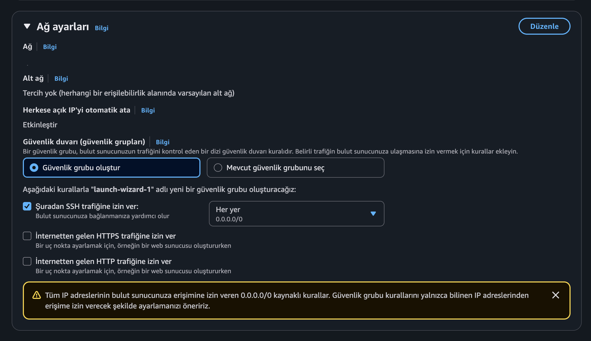
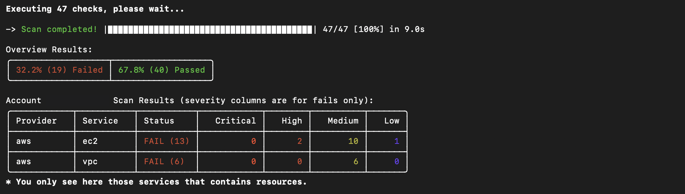
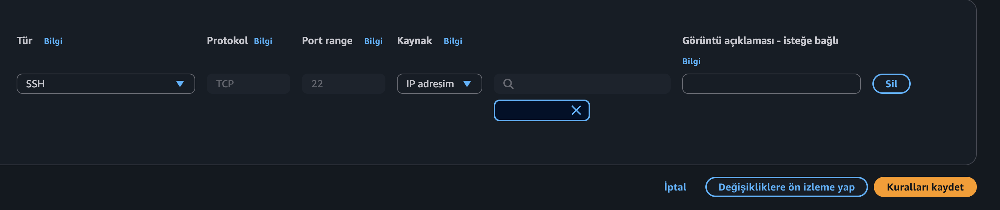
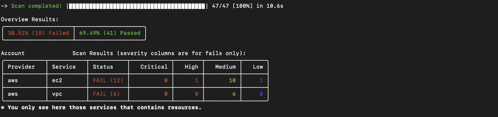
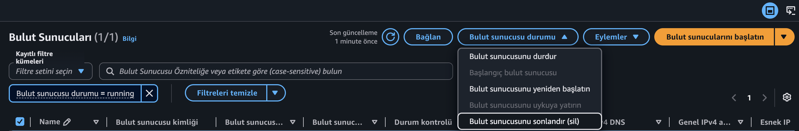

# AWS EC2 Perimeter Hardening & Remediation Lab

<p align="center">
  <a href="#türkçe-dokümantasyon">Türkçe Dokümantasyon</a> • 
  <a href="#english-documentation">English Documentation</a>
</p>

---

## Türkçe Dokümantasyon

### Proje Özeti
Bu laboratuvar çalışmasında, AWS bulut altyapısı üzerinde kasıtlı olarak kritik bir ağ zafiyeti oluşturulmuş, **Prowler CLI** aracı kullanılarak bu zafiyet tespit edilmiş ve ardından **Remediation (İyileştirme)** adımları uygulanarak atak yüzeyi tamamen kapatılmıştır.

---
## Bu Çalışmayı Neden Yaptık? (The "Why")
AWS EC2 sunucuları, altyapının doğrudan işletim sistemi seviyesinde çalışan en kritik hesaplama üniteleridir. Bu sunucuların dış dünya ile olan trafiğini denetleyen katman ise **Security Groups** (Sanal Güvenlik Duvarları) mekanizmasıdır. Bu çalışmayı, sunucunun yönetim kapısı olan **Port 22 (SSH)** erişimini kontrol altına almak ve siber saldırı yüzeyini (Attack Surface) daraltarak yalnızca yetkilendirilmiş kaynakların sunucuya komut gönderebilmesini sağlamak amacıyla yaptık.

## Yapmazsak Ne Olurdu? (Siber Zafiyet Senaryoları)
Eğer Port 22 (SSH) kuralı internete tamamen açık (`0.0.0.0/0`) bırakılsaydı karşılaşacağımız siber tehdit senaryoları şunlardı:
* **Otomatize Brute-Force:** İnternetteki botlar ve Shodan gibi ağ tarayıcıları sunucunun açık SSH portunu saniyeler içinde keşfeder ve işletim sistemine sızmak için aralıksız kaba kuvvet (parola/anahtar deneme) saldırıları başlatırdı.
* **Sunucu İstilası ve Lateral Movement:** Bir saldırgan SSH üzerinden sunucuya sızdığında işletim sisteminde tam yetki (Root) elde eder, sunucu kaynaklarını botnet veya kripto madenciliği (Crypto-jacking) için sömürür ve sunucuya bağlı olan IAM rollerini kullanarak VPC içerisindeki diğer AWS servislerine sıçrayabilirdi.

### ⚠️ 1. Senaryo ve Siber Zafiyetin Oluşturulması
Europe (Frankfurt) bölgesinde canlı bir EC2 sanal sunucusu ayağa kaldırılmıştır. Kurulum esnasında Güvenlik Grubu (Security Group) gelen kuralları (Inbound Rules), yönetim portu olan **Port 22 (SSH)** için tüm internete (`0.0.0.0/0`) açık hale getirilmiştir. SSH portunun dış dünyaya tamamen açık bırakılması, kaba kuvvet (Brute-Force) saldırılarına ve siber korsanların sunucuya sızma girişimlerine doğrudan davetiye çıkarmaktadır.

<p align="center">
  
  <br>
  <em>Görsel 1: launch-wizard-1 Güvenlik Grubunun oluşturulması ve SSH portunun tüm internete açılması</em>
</p>

---

### 🔍 2. Prowler ile Tespit Aşaması (Detection)
Mac terminali üzerinden Prowler aracı sadece EC2 ve Ağ servislerine odaklanacak şekilde aşağıdaki komutla çalıştırılmıştır:

```bash
prowler aws --service ec2 vpc -f eu-central-1
```

Yapılan ilk denetimde, bulut altyapısında genel olarak **19 adet Başarısız (Failed)** bulgu listelenmiş ve açtığımız port zafiyeti **High (Yüksek)** risk başlığı altında raporlanmıştır. Prowler'ın ürettiği ilk HTML rapor çıktısında (13:47 zaman damgalı), sistem sağlığı **40 Passed** ve **19 Failed** olarak belgelenmiştir.

<p align="center">
  
  <br>
  <em>Görsel 2: Remediation öncesi Prowler taraması terminal özeti (19 Failed, 40 Passed)</em>
</p>

---

### 🛠️ 3. İyileştirme Aşaması (Remediation)
Tespit edilen kritik bulgunun ardından AWS Konsoluna gidilmiş ve ilgili `launch-wizard-1` güvenlik grubunun kuralları güncellenmiştir. Eski ayar olan `0.0.0.0/0` (Her Yerden) kuralı silinerek, sadece denetçinin güvenli IP adresine izin verecek şekilde **My IP (IP adresim)** konfigürasyonuna çekilmiştir. Böylece sunucunun yönetim portu dış dünyaya tamamen kapatılarak ağ çeperi sıkılaştırılmıştır.

<p align="center">
  
  <br>
  <em>Görsel 3: SSH kuralının kaynak kısmının 'IP adresim' olarak güncellenmesi</em>
</p>

---

### 🚀 4. Doğrulama ve Son Durum (Verification)
İyileştirme kuralı kaydedildikten sonra Prowler denetimi aynı bölge filtresiyle yeniden koşturulmuştur. Yeniden yapılan analizde, genel sistem sağlığındaki:
* **Failed** sayısının **19'dan 18'e düştüğü**,
* **Passed** sayısının ise **40'tan 41'e yükseldiği** (1 adet zafiyetin başarıyla temizlendiği)

hem terminal özetinde hem de yeni üretilen HTML rapor dosyasında (14:03 zaman damgalı) doğrulanmıştır. 

> [!NOTE]
> Kalan 1 adet High risk ise AWS'in otomatik olarak oluşturduğu "Default Security Group" mimarisinin yerleşik izinlerinden kaynaklanmaktadır. 

Bu çalışma ile CSPM (Cloud Security Posture Management) süreçleri canlı bir senaryo üzerinde başarıyla simüle edilmiş ve siber riskler azaltılmıştır.

<p align="center">
  
  <br>
  <em>Görsel 4: Remediation sonrası Prowler taraması terminal özeti (18 Failed, 41 Passed)</em>
</p>

---

### 🧹 5. Temizlik ve Kaynakların Kapatılması (Cleanup)
Lab çalışması tamamlandıktan sonra, gereksiz maliyetlerin oluşmasını önlemek ve güvenlik risklerini tamamen ortadan kaldırmak amacıyla canlı EC2 sanal sunucusu AWS Konsolu üzerinden sonlandırılmıştır (Terminate).

<p align="center">
  
  <br>
  <em>Görsel 5: Canlı EC2 örneğinin sonlandırılması (Terminate) işlemi</em>
</p>

---
---

## English Documentation

### Project Overview
In this lab study, a critical network vulnerability was intentionally created on AWS cloud infrastructure, detected using the **Prowler CLI** security tool, and then mitigated by applying **Remediation** steps to completely close the attack surface.

---

## Bu Çalışmayı Neden Yaptık? (The "Why")
AWS EC2 instances are the most critical computing units running directly at the operating system level. The layer controlling the traffic between these instances and the outside world is the **Security Groups** mechanism. We performed this hardening to take control of **Port 22 (SSH)**, which is the administrative gateway of the server, and to minimize the attack surface, ensuring only authorized sources can send commands to the instance.

## Yapmazsak Ne Olurdu? (Siber Zafiyet Senaryoları / What If We Didn't?)
If the Port 22 (SSH) rule was left completely open to the internet (`0.0.0.0/0`), we would face the following cyber threat scenarios:
* **Automated Brute-Force:** Internet bots and network scanners like Shodan would discover the open SSH port within seconds, launching relentless brute-force attacks to breach the operating system.
* **Instance Compromise & Lateral Movement:** Once an attacker gained access via SSH, they would obtain root privileges on the OS, exploit instance resources for botnets or crypto-jacking, and potentially leverage attached IAM roles to move laterally into other AWS services within the VPC.

### ⚠️ 1. Scenario & Cyber Vulnerability Creation
A live EC2 virtual server was deployed in the Europe (Frankfurt) region. During configuration, the Inbound Rules of the Security Group were set to allow management traffic on **Port 22 (SSH)** from the entire internet (`0.0.0.0/0`). Leaving the SSH port fully open to the outside world directly invites brute-force attacks and unauthorized server intrusion attempts by malicious actors.

<p align="center">
  
  <br>
  <em>Figure 1: Creating launch-wizard-1 Security Group and opening SSH port to the public internet</em>
</p>

---

### 🔍 2. Detection with Prowler
Using the macOS terminal, the Prowler tool was executed focusing exclusively on EC2 and network services with the following command:

```bash
prowler aws --service ec2 vpc -f eu-central-1
```

In the initial audit, a total of **19 Failed** findings were listed across the cloud infrastructure, and the opened port vulnerability was reported under the **High** risk category. In Prowler's first HTML report output (timestamped 13:47), the system health was documented as **40 Passed** and **19 Failed**.

<p align="center">
  
  <br>
  <em>Figure 2: Prowler scan terminal summary prior to remediation (19 Failed, 40 Passed)</em>
</p>

---

### 🛠️ 3. Remediation Phase
Following the detection of the critical finding, the AWS Console was accessed, and the inbound rules for the `launch-wizard-1` security group were updated. The legacy rule of `0.0.0.0/0` (Anywhere) was removed and replaced with a **My IP** configuration, allowing access only from the auditor's secure IP address. This completely closed the server's management port to the public internet, successfully hardening the network perimeter.

<p align="center">
  
  <br>
  <em>Figure 3: Updating SSH rule source configuration to 'My IP'</em>
</p>

---

### 🚀 4. Verification & Final State
Once the remediation rule was saved, the Prowler audit was executed again using the same region filter. In the follow-up analysis, both the terminal summary and the newly generated HTML report (timestamped 14:03) confirmed that:
* The number of **Failed** findings decreased from **19 to 18**,
* The **Passed** findings increased from **40 to 41** (verifying that 1 vulnerability was successfully resolved).

> [!NOTE]
> The remaining 1 High-risk finding stems from the default permissions of the "Default Security Group" automatically created by AWS.

Through this lab, CSPM (Cloud Security Posture Management) workflows were successfully simulated in a live environment, and cyber security risks were minimized.

<p align="center">
  
  <br>
  <em>Figure 4: Prowler scan terminal summary after remediation (18 Failed, 41 Passed)</em>
</p>

---

### 🧹 5. Lab Cleanup & Termination
After completing the lab activities, the live EC2 virtual server was terminated via the AWS Console to prevent any ongoing security risks and avoid unnecessary cloud hosting costs.

<p align="center">
  
  <br>
  <em>Figure 5: Terminating the active EC2 instance to clean up the environment</em>
</p>
